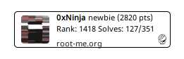

# Root-Me badge

Generate your Root-Me badge in PHP !

## Table of content

1. [Overview](#overview)

2. [Dependencies](#dependencies)

3. [How to install and use](#how-to-install-and-use)

	3.1. [Install Requests](#install-requests)
	
	3.2. [Install the badge generator](#install-the-badge-generator)
	
	3.3. [Tweak your config](#tweak-your-config)

4. [Imrovements](#improvements)

## Overview

With this php script you can generate your own Root-Me badge :



## Dependencies

This script uses the [Request PHP library](https://github.com/rmccue/Requests) in order to make web requests on Root-Me's website.

You will need to install it on your server before using the badge generator.

## How to install and use

### Install Requests

Go to the library's repo : [Request PHP library](https://github.com/rmccue/Requests)

Install from the source :

```bash
git clone git://github.com/rmccue/Requests.git
```

And... voilà !

### Install the badge generator

Install from the source :

With SSH

```bash
git clone git@github.com:OxNinja/root-me_badge.git
```

Or via HTTPS

```bash
git clone https://github.com/OxNinja/root-me_badge.git
```

You just have to include the bagde generator in your web page :

```php
<?php include("/your/path/to/root-me-bage.php"); ?>
```

Make sure you have the right path to the Requests library in `root-me-badge.php`.

### Tweak your config

You may now see your Root-Me badge on your webpage. You can modify some variables in order to tweak the badge as you wish.

## Imrpovements

Yeah I thought about some adjustements to do :

* Use a configuration file to easilly customize the badge
* Use Root-Me's new API ?
